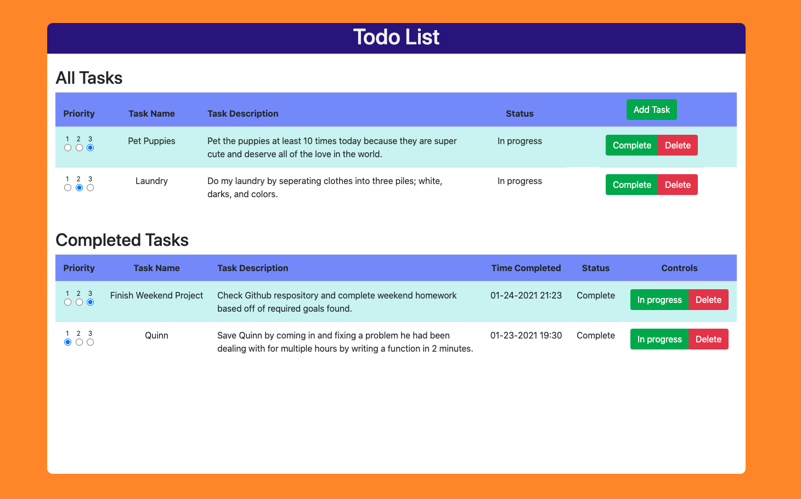
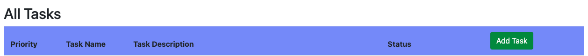
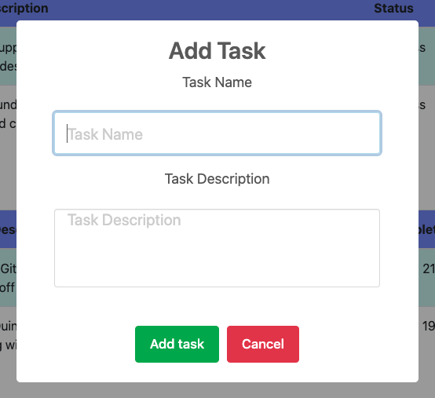
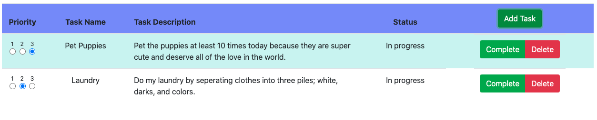
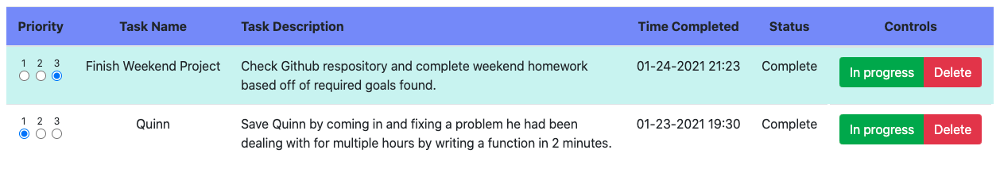
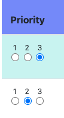
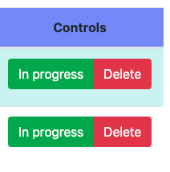
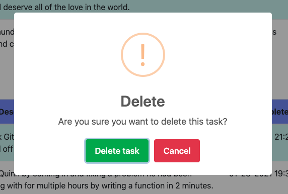

# Todo List

## Application Description

_Duration: Weekend Assignment_

This is a todo list that allows you to add tasks, mark tasks complete or in progress, and allows you to delete tasks.

## Application Preview

## Application Prerequisites

1. Node.js
2. Express
3. Postgres

## Installation

1. Open application and run "npm install" in your terminal
2. Copy SQL from database.sql into a database (Postgres and Postico recommended)
3. Run npm start to start the server

## Usage

1. Add a task by clicking the add task button and filling out the popup form

2. Move tasks from table to table by clicking either the complete or in progress buttons

3. Change the priority of a task by clicking one of the three priority buttons. Tasks come in as "2" or medium priority, with "1" being the lowest and "3" being the highest priority.

4. Delete a task by clicking the delete button and then clicking the delete task button

## Built With

1. jQuery
2. Bootstrap
3. Moment.js
4. Sweet Alerts 2